# Phase 1: プロジェクト環境構築・PowerProvider・SDK初期化

## 📋 概要

このPhaseでは、Vite + React + TypeScript プロジェクトの初期化と、Power Apps Code Apps対応の設定を行います。

**主な実施内容:**
- Vite Reactプロジェクトの作成
- Power Apps Code Apps初期化
- PowerProviderの実装
- SDK初期化と統合
- 基本的な動作確認

---

## 🚀 クイックリファレンス

**実施するStep（概要）:**
1. **プロジェクト作成・初期化** - Vite + React + TypeScript
2. **依存関係インストール** - `npm install` と初回ビルド
3. **vite.config.ts設定** - Power Apps対応設定
4. **PowerProvider.tsx実装** - SDK初期化コンポーネント
5. **main.tsx統合** - PowerProviderの組み込み
6. **pac code init** - Power Apps Code統合
7. **エラーチェック** - TypeScript・ESLint・ビルド確認

**統合コマンド（すべてのチェック）:**
```bash
# ビルド・リント・型チェックを一括実行
npm run build && npm run lint && npx tsc --noEmit
```

**Phase 1 完了条件:**
- ✅ TypeScript エラー: 0件
- ✅ ESLint エラー: 0件
- ✅ ビルドエラー: 0件
- ✅ `pac code init` 正常完了
- ✅ PowerProvider.tsx 正常動作

> **📘 詳細な実装手順**: 以下のステップバイステップガイドを参照してください。

---

## 🎯 Phase 1の目標

```mermaid
graph LR
    A[Vite+React+TypeScript初期化] --> B[Power Apps Code Apps設定]
    B --> C[PowerProvider実装]
    C --> D[SDK初期化・統合]
    D --> E[エラーチェック]
    E --> F[基盤完了]
```



**完了条件:**
- ✅ Viteプロジェクトが正常にビルドできる
- ✅ Power Apps SDKが正常に初期化される
- ✅ ローカルでアプリが起動する
- ✅ Power Apps環境でアプリが表示される

---

## 📝 Step詳細

### **Step 1: Vite App初期化**

#### 1-1. プロジェクトディレクトリ作成

```bash
mkdir C:\CodeApps -Force
cd C:\CodeApps
```

#### 1-2. Viteプロジェクト作成

```bash
npm create vite@latest AppFromScratch -- --template react-ts
cd C:\CodeApps\AppFromScratch
npm install
```

**注意事項** (Microsoft公式より):
- create-viteのインストールに同意する（初回のみ）
- パッケージ名 `appfromscratch` をEnterで受け入れる
- フレームワーク選択: **React**
- バリアント選択: **TypeScript**

#### 1-3. Node型定義のインストール

```bash
# Node型定義をインストール (必須)
npm i --save-dev @types/node
```

**なぜ必要？**
- Vite設定ファイルで`path`モジュールを使用するため
- TypeScriptコンパイルエラーを防ぐため

---

### **Step 2: Code App初期化**

#### 2-1. Power Platform認証

```bash
pac auth create
```

**実行内容:**
- ブラウザが開き、Microsoft アカウントでサインイン
- Power Platform環境へのアクセス権限を付与

#### 2-2. 環境選択

```bash
pac env select --environment <環境のURL>
```

**環境URLの確認方法:**
1. [Power Apps](https://make.powerapps.com) にアクセス
2. 右上の環境選択から対象環境を選択
3. 設定アイコン → 開発者リソース → インスタンスURLをコピー

**例:**
```bash
pac env select --environment https://your-org.crm7.dynamics.com
```

#### 2-3. Code Apps初期化

```bash
pac code init --displayName "App From Scratch"
```

**実行内容:**
- `.pac` フォルダが作成される
- Power Apps Code Appsの設定ファイルが生成される
- アプリが環境に登録される

**オプション:**
```bash
# ロゴ付きで初期化
pac code init --displayName "My App" --logo "./public/assets/logo.svg"

# 既存アプリのロゴを更新
pac code update --logo "./public/assets/logo.svg"
```

#### 2-4. Power Apps SDK インストール

```bash
npm install --save "@microsoft/power-apps"
```

**インストール内容:**
- `@microsoft/power-apps` パッケージ
- Power Apps SDKのランタイム
- データソース接続用のAPI

---

### **Step 3: vite.config.ts 設定**

#### 3-1. vite.config.ts を編集

**ファイルパス:** `vite.config.ts`

```typescript
import { defineConfig } from 'vite'
import react from '@vitejs/plugin-react'
import * as path from 'path'

// https://vite.dev/config/
export default defineConfig({
  base: "./",  // 🚨重要: Power Apps デプロイ必須設定
  server: {
    host: "::",
    port: 3000,  // Power SDK requires port 3000
  },
  plugins: [react()],
  resolve: {
    alias: {
      "@": path.resolve(__dirname, "./src"),
    },
  },
});
```

**重要な設定項目:**

| 設定項目 | 値 | 理由 |
|---------|-----|------|
| `base` | `"./"` | Power Appsデプロイ時の相対パス解決に必須 |
| `server.port` | `3000` | Power Apps SDKが要求するポート番号 |
| `server.host` | `"::"` | 外部からのアクセスを許可（Power Apps環境からの接続用） |
| `resolve.alias` | `@: ./src` | インポートパスの短縮（shadcn/ui等で使用） |

**注意:**
- `base: "./"`を設定しないと、デプロイ後にアセットが読み込まれない
- ポート3000以外を使用すると、Power Apps SDKが正常に動作しない

---

### **Step 4: PowerProvider.tsx追加**

#### 4-1. PowerProvider.tsxファイルを作成

**ファイルパス:** `src/PowerProvider.tsx`

**取得元:**
- 公式GitHubサンプル: [HelloWorld](https://github.com/microsoft/PowerAppsCodeApps/tree/main/samples/HelloWorld), [StaticAssetTracker](https://github.com/microsoft/PowerAppsCodeApps/tree/main/samples/StaticAssetTracker)

**PowerProviderの役割:**
1. **Power Apps SDKの初期化**
   - `initialize()`関数でSDKを初期化
   - アプリケーション起動時に一度だけ実行

2. **初期化状態の管理**
   - エラーハンドリング
   - 初期化完了後のアプリ表示

**基本構造:**
```typescript
import { initialize } from "@microsoft/power-apps/app";
import { useEffect, type ReactNode } from "react";

interface PowerProviderProps {
    children: ReactNode;
}

export default function PowerProvider({ children }: PowerProviderProps) {
    useEffect(() => {
        const initApp = async () => {
            try {
                await initialize();
                console.log('Power Apps SDK initialized successfully');
            } catch (error) {
                console.error('Power Apps SDK initialization failed:', error);
            }
        };
        initApp();
    }, []);

    return <>{children}</>;
}
```

---

### **Step 5: main.tsx更新**

#### 5-1. PowerProviderをインポート

**ファイルパス:** `src/main.tsx`

```typescript
import { StrictMode } from 'react'
import { createRoot } from 'react-dom/client'
import './index.css'
import App from './App.tsx'
import PowerProvider from './PowerProvider.tsx'  // 追加
```

#### 5-2. App コンポーネントをラップ

**変更前:**
```typescript
createRoot(document.getElementById('root')!).render(
  <StrictMode>
    <App />
  </StrictMode>,
)
```

**変更後:**
```typescript
createRoot(document.getElementById('root')!).render(
  <StrictMode>
    <PowerProvider>
      <App />
    </PowerProvider>
  </StrictMode>,
)
```

**なぜ必要？**
- すべての子コンポーネントでPower Apps SDKにアクセスできるようにする
- データソース接続を一元管理する
- 初期化エラーを適切にハンドリングする

---

### **Step 6: package.json スクリプト更新**

#### 6-1. devスクリプトを変更

**ファイルパス:** `package.json`

**Windows:**
```json
{
  "scripts": {
    "dev": "start pac code run && vite",
    "build": "tsc -b && vite build",
    "lint": "eslint .",
    "preview": "vite preview"
  }
}
```

**macOS/Linux:**
```json
{
  "scripts": {
    "dev": "vite && pac code run",  // startコマンド不要
    "build": "tsc -b && vite build",
    "lint": "eslint .",
    "preview": "vite preview"
  }
}
```

**スクリプトの動作:**
1. `pac code run` - Power Apps SDKサーバーを起動
2. `vite` - Vite開発サーバーを起動

**Windowsで `start` が必要な理由:**
- `pac code run`をバックグラウンドで実行するため
- 同時に`vite`を起動するため

---

### **Step 7: テスト実行**

#### 7-1. 開発サーバー起動

```bash
npm run dev
```

**期待される動作:**
1. Power Apps SDK サーバーが起動（別ウィンドウまたはバックグラウンド）
2. Vite開発サーバーが起動（http://localhost:3000）
3. ブラウザが自動的に開く（または手動でアクセス）

#### 7-2. 動作確認

**ローカル環境:**
- ブラウザで http://localhost:3000 にアクセス
- デフォルトのReactアプリが表示される
- コンソールエラーがないことを確認

**Power Apps環境:**
1. [Power Apps](https://make.powerapps.com) にアクセス
2. アプリ一覧から作成したアプリを選択
3. アプリが正常に表示されることを確認

#### 7-3. トラブルシューティング

**エラー: "Cannot find module '@microsoft/power-apps'"**
```bash
# 解決策: SDKを再インストール
npm install --save "@microsoft/power-apps"
```

**エラー: "Port 3000 is already in use"**
```bash
# 解決策: 既存プロセスを終了してから再起動
# Windowsの場合
netstat -ano | findstr :3000
taskkill /PID <プロセスID> /F

# または別のポートを使用（非推奨）
# vite.config.ts で server.port を変更
```

**エラー: "PowerProvider initialization failed"**
- Power Platform認証が期限切れの可能性
```bash
# 解決策: 再認証
pac auth create
pac env select --environment <環境のURL>
```

---

## ✅ Phase 1 完了チェックリスト

### 開発環境
- [ ] Viteプロジェクトが作成されている
- [ ] `npm install` が正常に完了している
- [ ] `@types/node` がインストールされている

### Power Apps設定
- [ ] `pac auth create` で認証が完了している
- [ ] `pac env select` で環境が選択されている
- [ ] `pac code init` でアプリが作成されている
- [ ] `@microsoft/power-apps` がインストールされている

### ファイル設定
- [ ] `vite.config.ts` に `base: "./"` が設定されている
- [ ] `vite.config.ts` に `server.port: 3000` が設定されている
- [ ] `src/PowerProvider.tsx` が作成されている
- [ ] `src/main.tsx` に `PowerProvider` が追加されている
- [ ] `package.json` の `dev` スクリプトが更新されている

### 動作確認
- [ ] `npm run dev` でサーバーが起動する
- [ ] http://localhost:3000 にアクセスできる
- [ ] Power Apps環境でアプリが表示される
- [ ] ブラウザコンソールにエラーが表示されない

### ビルド確認
- [ ] `npm run build` が成功する
- [ ] `npm run lint` でエラーが表示されない
- [ ] `npx tsc --noEmit` でTypeScriptエラーがない

---

## 📚 関連リファレンス

### 公式ドキュメント
- [Power Apps Code Apps 公式ドキュメント](https://learn.microsoft.com/ja-jp/power-apps/developer/code-apps/)
- [PAC CLI リファレンス](https://learn.microsoft.com/ja-jp/power-platform/developer/cli/reference/code)
- [Vite 公式ドキュメント](https://vitejs.dev/)

### 内部リファレンス
- **[docs/README.md](./docs/README.md)** - ドキュメント一覧とナビゲーション
- **[docs/INDEX.md](./docs/INDEX.md)** - 開発フェーズ別ガイド

---

## 🔄 次のステップ

Phase 1が完了したら、次は **Phase 2: UI基盤・デザインシステム・MVP構築** に進みます。

👉 **[Phase 2 リファレンス](./PHASE2_UI_DESIGN_SYSTEM.md)** に進む
