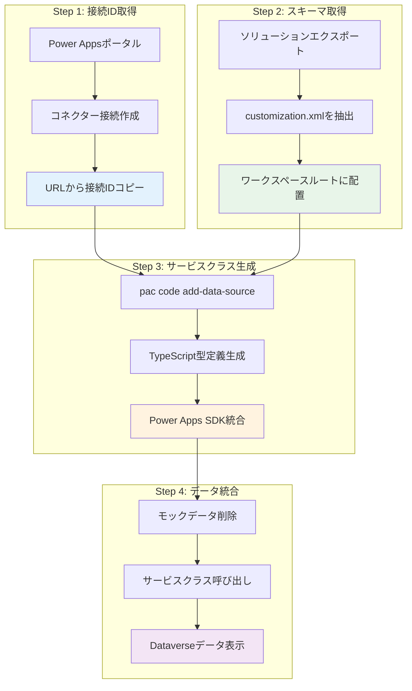
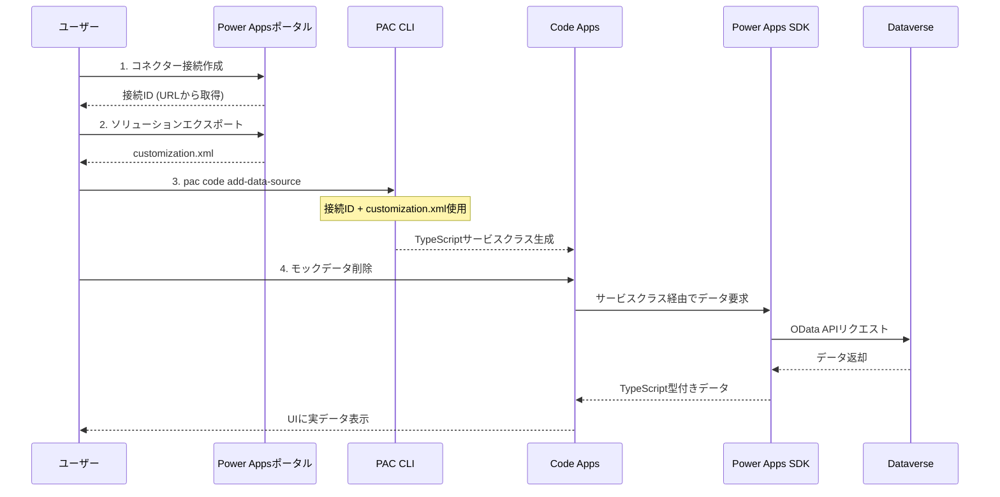

# Phase 5: 概要とアーキテクチャ

## 📋 このドキュメントについて

このドキュメントでは、Phase 5（データソース統合）の全体像とアーキテクチャについて説明します。

---

## 🎯 Phase 5の目標

**Phase 5では、モックデータから実データへの完全移行を実現します。**

### 完了条件

- ✅ データソースが正常に接続されている
- ✅ Dataverseテーブルからデータを取得できる
- ✅ CRUD操作が正常に動作する
- ✅ エラーハンドリングが適切に実装されている
- ✅ モックデータが完全に削除されている

### 主な実施内容

- データソース接続の設定
- Dataverseテーブルへのアクセス
- カスタムフックの作成
- UI統合とエラーハンドリング
- 機能拡張の実装

---

## 🏗️ リアルデータ接続のアーキテクチャ

### 4ステップの概要

Power Apps Code Appsにおける実データ接続は、以下の4つのステップで実現されます。



### 4ステップの詳細

| ステップ | 実施内容 | 成果物 | 所要時間 |
|---------|---------|-------|---------|
| **1. 接続ID取得** | Power Appsポータルで手動接続作成 → URLから接続IDをコピー | 接続ID (GUID形式) | 2-3分 |
| **2. スキーマ取得** | ソリューションをエクスポート → customization.xmlをワークスペースルートに配置 | customization.xml | 5分 |
| **3. サービスクラス生成** | `pac code add-data-source` 実行 → Power Apps SDKベースのTypeScriptコード自動生成 | サービスクラス (.ts) | 1-2分 |
| **4. データ統合** | モックデータ削除 → サービスクラス呼び出しでDataverseデータ取得 | 実データ表示 | 10-30分 |

---

## 🔄 データフロー



---

## 🔑 重要な技術要素

### Power Apps SDK の役割

Power Apps SDKは、Code AppsとDataverseの橋渡しを行います。

```typescript
// Power Apps SDKが提供する主要な機能
import { usePowerPlatform } from '@microsoft/power-apps';
import type { IOperationResult } from '@microsoft/power-apps/data';

// 1. SDK初期化状態の確認
const { isInitialized } = usePowerPlatform();

// 2. サービスクラスを通じたデータアクセス
const result: IOperationResult<SystemUsers[]> = await SystemUsersService.getAll({
  select: ['systemuserid', 'fullname'],
  filter: 'isdisabled eq false'
});

// 3. 型安全なエラーハンドリング
if (result.isSuccess && result.value) {
  // データ取得成功
  console.log(result.value);
} else {
  // エラー処理
  console.error(result.error);
}
```

### customization.xml の重要性

`customization.xml` には以下の重要なスキーマ情報が含まれています:

- **テーブル定義**: 論理名、物理名、主キー
- **フィールド定義**: データ型、必須/任意、最大長
- **Choice値**: オプションセットの値とラベル
- **リレーションシップ**: Lookup/1対多/多対多の関係

この情報を基に、`pac code add-data-source` がTypeScript型定義を自動生成します。

**customization.xml の例:**

```xml
<ImportExportXml>
  <Entities>
    <Entity Name="geek_project_task">
      <EntityInfo>
        <entity Name="geek_project_task">
          <LocalizedNames>
            <LocalizedName description="プロジェクトタスク" languagecode="1041" />
          </LocalizedNames>
          <attributes>
            <attribute PhysicalName="geek_name" LogicalName="geek_name" Type="nvarchar" />
            <attribute PhysicalName="geek_assignedto" LogicalName="geek_assignedto" Type="lookup" />
          </attributes>
        </entity>
      </EntityInfo>
    </Entity>
  </Entities>
</ImportExportXml>
```

---

## ⚠️ 重要: SDK初期化とコネクター接続のタイミング

DataverseやOffice 365コネクターなどに接続する場合、**Power Apps SDKの初期化が完了してから**コネクターに接続する必要があります。

### よくあるエラー

```text
Error fetching SystemUsers: PowerDataRuntimeError: An unknown error occurred: 
PowerDataRuntime is not initialized. Please call initializeRuntime() first.
```

**原因:**  
PowerDataRuntime（Power Apps SDK）が初期化される前にDataverseテーブルにアクセスしようとした

### 正しい実装パターン

```typescript
import { usePowerPlatform } from '@microsoft/power-apps';
import { useEffect, useState } from 'react';

export function App() {
  const { isInitialized } = usePowerPlatform();
  const [data, setData] = useState([]);

  useEffect(() => {
    // ✅ SDK初期化完了後にのみデータ取得
    if (!isInitialized) {
      console.log('Power Apps SDK 初期化中...');
      return;
    }

    loadData();
  }, [isInitialized]);

  // ❌ 初期化前にレンダリングしない
  if (!isInitialized) {
    return <div>初期化中...</div>;
  }

  return <YourApp data={data} />;
}
```

**重要なポイント:**

- ✅ `usePowerPlatform().isInitialized` で初期化状態をチェック
- ✅ `isInitialized === false` の間はLoading表示
- ✅ `isInitialized === true` になってからDataverseアクセス
- ✅ `useEffect` の依存配列に `isInitialized` を含める
- ❌ 初期化前にサービスクラスのメソッドを呼び出さない

---

## 💡 ベストプラクティス

### 1. エラーハンドリング

```typescript
const result = await SystemUsersService.getAll();

if (result.isSuccess && result.value) {
  // ✅ 成功時の処理
  setData(result.value);
} else {
  // ✅ エラー時の処理
  console.error('Error:', result.error);
  setError(result.error?.message || 'データ取得に失敗しました');
}
```

### 2. ローディング状態の管理

```typescript
const [loading, setLoading] = useState(true);

try {
  setLoading(true);
  const result = await SystemUsersService.getAll();
  // ... データ処理
} catch (error) {
  console.error(error);
} finally {
  setLoading(false); // ✅ 必ずloadingをfalseに
}
```

### 3. 型安全性の確保

```typescript
// ✅ 生成された型を使用
import type { SystemUsers } from '../generated/models/SystemUsersModel';

const [users, setUsers] = useState<SystemUsers[]>([]);

// ❌ any型は使用しない
// const [users, setUsers] = useState<any>([]);
```

### 4. カスタムフックでロジックを分離

```typescript
// src/hooks/useSystemUsers.ts
export const useSystemUsers = () => {
  const { isInitialized } = usePowerPlatform();
  const [users, setUsers] = useState<SystemUsers[]>([]);
  const [loading, setLoading] = useState(true);
  const [error, setError] = useState<string | null>(null);

  // ... ロジック

  return { users, loading, error, refetch };
};

// コンポーネントでは簡潔に使用
function UserList() {
  const { users, loading, error } = useSystemUsers();
  
  if (loading) return <div>Loading...</div>;
  if (error) return <div>Error: {error}</div>;
  
  return <div>{users.map(user => ...)}</div>;
}
```

---

## 📖 次のステップ

Phase 5の概要を理解したら、以下のドキュメントで具体的な実装を進めてください:

1. **[接続セットアップ](./PHASE5_02_CONNECTION_SETUP.md)** - 接続IDの取得とスキーマ取得
2. **[サービスクラス生成](./PHASE5_03_SERVICE_GENERATION.md)** - `pac code add-data-source`の実行
3. **[モックデータからリアルデータへの移行](./PHASE5_04_MOCK_TO_REAL.md)** - カスタムフック実装
4. **[実装例](./PHASE5_07_EXAMPLES.md)** - 実際のコード例

---

## 🔗 関連ドキュメント

- [Dataverseトラブルシューティング完全ガイド](../DATAVERSE_TROUBLESHOOTING.md)
- [Dataverseスキーマリファレンス](../DATAVERSE_SCHEMA_REFERENCE.md)
- [Lookupフィールド実装ガイド](../LOOKUP_FIELD_GUIDE.md)

---

## 💡 重要原則

> **⚠️ Power Apps Code Appsでは、必ずPower Apps SDK経由で自動生成されたサービスクラスを使用します。**
>
> Dataverse Web API、Xrm.WebApi、直接REST APIは使用しないでください。
